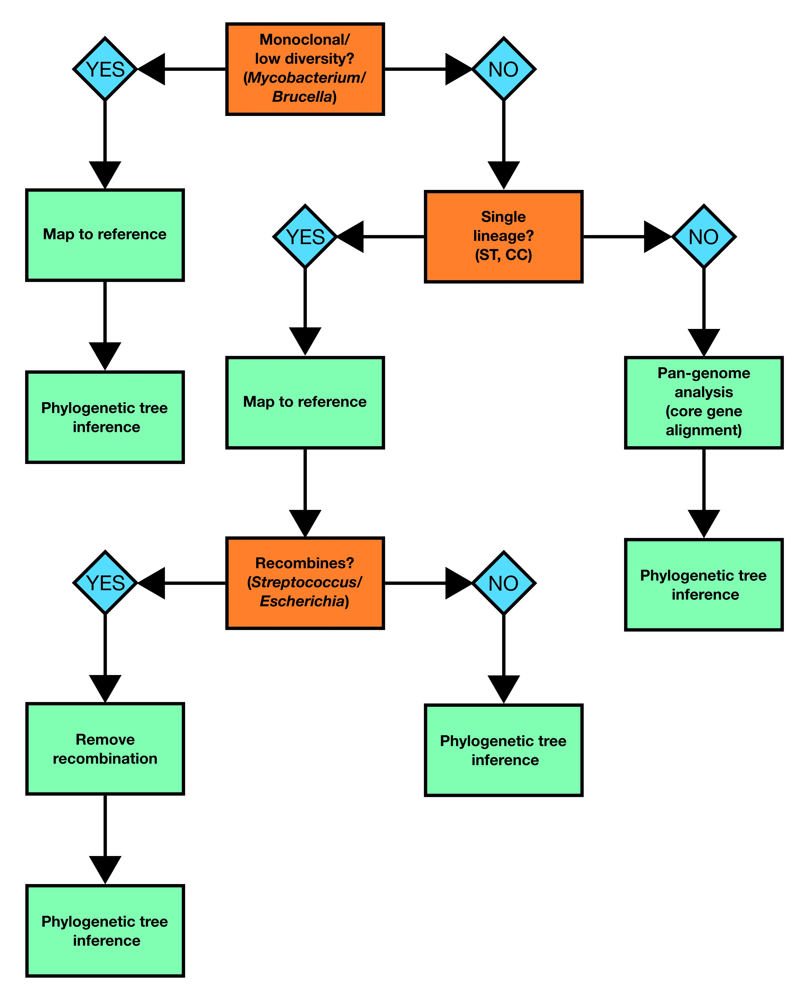

::: {.callout-tip}
## Learning Objectives

- Understand that there are different ways to construct a phylogenetic tree depending on what species you're analysing

:::

## Introduction

The purpose of this module is to provide a broad overview of inferring prokaryote phylogenetic trees with a focus on bacterial genomes.

Before starting your analysis, it's important to understand the characteristics of the species you're working with as this will determine how best to proceed.  In particular, you need to understand how much genetic diversity or plasticity is present in your bug and whether or not it recombines.  For instance the approach you take to build a phylogenetic tree of *Mycobacterium tuberculosis* genomes will differ from the methods you'd use to build a tree with *Escherichia coli*.  To help with making your decision, we've provided a flowchart which outlines the best approach to take depending on what your dataset is composed of:

The two most commonly applied methods for generating muliple sequence alignments to use for phylogenetic tree inference in bacterial genomics are reference-based whole genome alignments and core genome alignments generated by comparing genes between different isolates and identifying the genes found in all or nearly all isolates (the core genome).  As a broad rule of thumb, if your species is not genetically diverse and doesn't recombine (TB, *Brucella*) then picking a suitable good-quality reference and generating a whole genome alignment is appropriate.  However, when you have a lot of diversity or multiple divergent lineages (*E. coli*) then a single reference may not represent all the diversity in your dataset.  Here it would be more appropriate to create *de novo* assemblies, annotate them and then use a tool like `roary` or `panaroo` to infer the pan-genome and create a core genome alignment.  The same phylogenetic methods are then applied to either type of multiple sequence alignment.

## Mapping to a reference

The purpose of mapping sequence reads to a reference genome is to identify any phylogenetic-informative DNA changes (normally single nucleotide polymorphisms (SNPs)) in your samples relative to the reference.   For the positions in the reference genome where we don't see any differences in the mapped samples, we assume that that the nucleotide in that position is the one found in the reference.  There are a number of different tools for mapping sequence data to a reference genome (`bwa`, `bowtie2`) and calling variants (`bcftools`, `freebayes`), but the easiest way to do this is to use a pipeline such as [nf-core/bactmap](https://nf-co.re/bactmap).  `nf-core/bactmap` is a bioinformatics best-practice analysis pipeline for mapping short reads from bacterial whole genome sequences to a reference sequence, identifying the variants in each sample and creating a multiple sequence alignment that can then be used to create a phylogeny.  The pipeline is built using Nextflow, a workflow tool to run tasks across multiple compute infrastructures in a very portable manner. It uses Docker/Singularity containers making installation trivial and results highly reproducible.

### Picking a reference

Picking the best reference for your dataset is very important as this can have a large effect on the phylogenetic tree that's constructed. For some species with low diversity e.g. *M. tuberculosis*, it is usual to use the same reference (the lab strain H37v) regardless of what your dataset is comprised of. If your dataset is comprised of a single lineage (e.g. ST, CC), the best reference to use is one that is from the same or a closely related lineage.  For many of the most commonly sequenced bacteria, there are several different reference sequences available in public databases such as RefSeq, meaning that, in most instances, you can find a suitable reference.  However, for more diverse organisms, a single reference may not represent all the samples in your dataset.  In this instance, you may want consider comparing the similarity of your samples to a number of different reference sequences and pick the one that is similar to most samples in your dataset.

### Removing recombination

Recombination in bacteria is characterized by DNA transfer from one organism or strain (the donor) to another organism/strain (the recipient) or the uptake of exogenous DNA from the surrounding environment.  Broadly, there are three different types of bacterial recombination:

- Transformation: the uptake of exogenous DNA from the environment
- Transduction: virus-mediated (phage) transfer of DNA between bacteria
- Conjugation: the transfer of DNA from one bacterium to another via cell-to-cell contact

The sequences transferred via recombination can influence genome-wide measures of sequence simularity more than vertically-inherited point mutations that are the signal of shared common ancestor.  Thus, identifying recombinant regions and accounting for their potentially different phylogenetic history is crucial when examining the evolutionary history of bacteria.  In practice, what this means is that we remove (mask) previously identified recombinant regions in our multiple sequence alignmnents before we proceed with phylogenetic tree inference.  The two most commonly used tools to do this are `Gubbins` and `ClonalFrameML`. It's important to note that `Gubbins` cannot be used on the core gene alignment produced by tools like `roary` or `panaroo` as Gubbins requires a whole genome alignment as input in order to analyse the spatial distribution of base substitutions.  For this reason, the finer scale phylogenetic structure of phylogenetic trees generated using a core gene alignment may be less accurate.  If we want to properly account for recombination in this instance, typically we would perform some kind of clustering on our initial tree, then map sequence data for the samples within a cluster to a suitable reference before running our recombination removal tool of choice.

## Pan-genome analysis

When you have a very diverse dataset where no single reference is going to accurately reflect the population structure withn your dataset, then a reference independent approach such as constructing a core gene alignment as part of a pan-genome analysis is the best way to build a multiple sequence alignmnet for phylogenetic inference.  There are several tools available to do this including `roary`, `panaroo` and `panX`.  It's important to note that the alignments produced using these tools only contain the genes found in all or nearly all of the samples meaning that the amount of potentially phylogenetically informative information is reduced.  For this reason, core gene based phylogenies are useful for looking at a whole species but it's generally preferable to perform clustering and create new sub-trees using reference mapping if you're interested in examining the relationship between more closely related genomes.

## Exercises

### TB practical

### Pneumococcus practical

