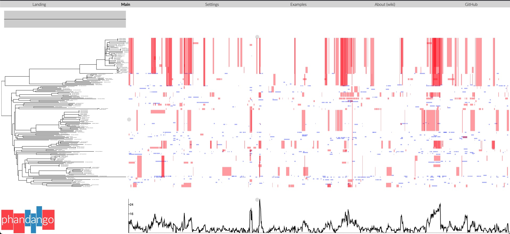
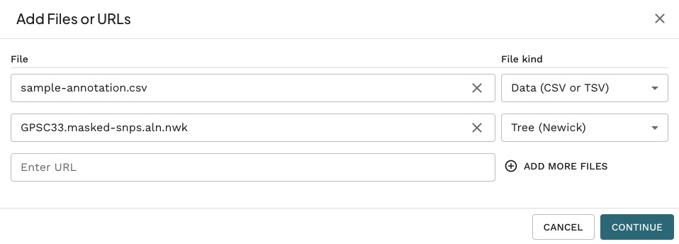
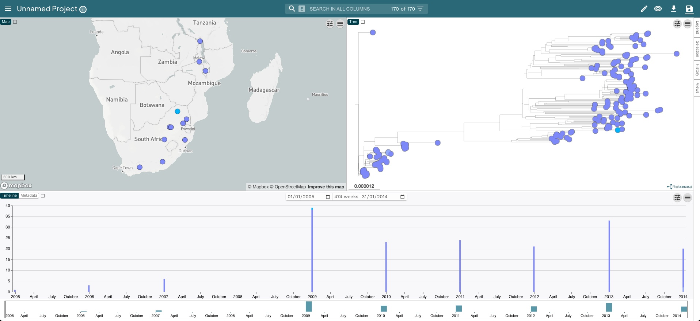
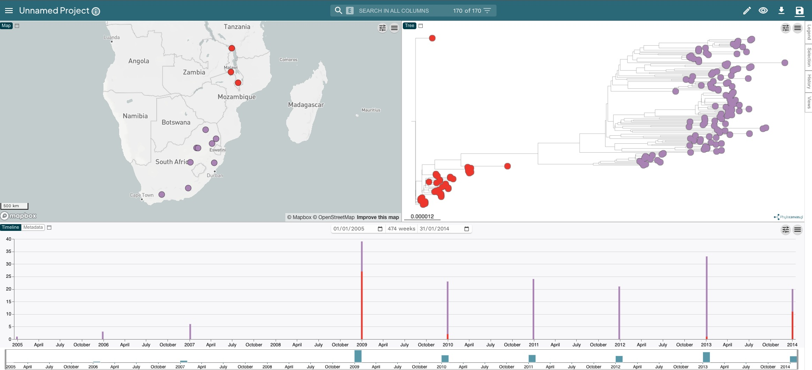

# Building a Phylogenetic Tree

::: {.callout-tip}
### Questions

- How can I produce a multiple sequence alignment of pneumococcal sequences?
- How can I build a phylogenetic tree from my alignment?
- How can I visualize and annotate my tree with metadata?
- How can I scale my tree based on sampling dates?

### Learning Objectives

- Use nf-core/bactmap to produce a multiple sequence alignment.
- Use Gubbins to identify recombinant regions
- Mask recombinant regions in multiple sequence alignment
- Use IQ-tree for phylogenetic tree inference.
- Visualize and annotate tree in Microreact.

:::

## Pneumococcal phylogenetics

*Streptococcus pneumoniae* (the pneumococcus)is a gram-positive human commensal that also causes a significant disease burden with pneumococcal-related diseases such as pneumonia and meningitis responsible for up 500,000 deaths in children <5 years old each year.  The primary pneumococcal virulence factor is the polysaccharide capsule that surrounds the cell.  One hundred different polysaccharide capsules (serotypes) have been identified to date and the conjugate vaccines that are routinely administered in vaccination programmes around the world typically target the 10-13 serotypes most prevalent in invasive pneumococcal disease (IPD).

The Global Pneumococcal Sequencing (GPS) project was set up to help understand the global picture of pneumococcal evolution during vaccine introductions using whole-genome sequencing.  By the end of 2019, the GPS project had sequenced more than 26,000 pneumococcal genomes from more than 50 countries.  As well as investigating the pre- and post-vaccine pneumococcal population structure, 13,454 GPS genomes were combined with an additional 7,000 published pneumococcal genomes to identify clusters of sequences defined as Global Pneumococcal Sequence Clusters (GPSCs).  The study identified 621 GPSCs and 35 GPSCs contained more than 100 isolates, accounting for the majority of genomes included in the dataset.  These clusters are increasingly being used as the standard method of lineage assignment in pneumococcus as tools now exist to allow new genomes to be assigned to existing clusters or else form the basis of novel clusters.

Uptake and incorporation of DNA from the environment into the pneumococcal chromosome via transformation and homologous recombination has been shown to contribute more to nucleotide variation than mutation in the pneumococcus.  As well as being biologically important, recombination obscures the true phylogenetic signal of vertical descent and needs to be accounted for when inferring pneumococcal phylogenies. 

## Pneumococcal dataset

The dataset chosen for this practical consists of 170 isolates from the GPSC33 lineage.  Isolates were collected in South Africa and Malawi
as part of the GPS project between 2009 and 2014.

::: {.callout-note}
#### Data for this section

We will work from the course materials folder called `02-prokaryotes`, which contains the following files: 

- `reference/GCA_901213345.1_12837_1_32_genomic.fna` is the reference genome
- `data` is the directory containing the fastq files we're going to map to the reference genome
- `sample_annotation.csv` is a comma-separated values (CSV) file with information about each sample such as the date of collection and country they were collected in. We will use this table to annotate our phylogenetic trees. This table can also be opened in a spreadsheet program such as Excel.
:::

## Generating an alignment

The first step in building a phylogenetic tree is to generate a multiple sequence alignment.  To do this, we're going to map the sequence data for our 170 pneumococcal genomes to a reference, in this case one of the GPS genomes, using the `nf-core/bactmap` pipeline.

First create a directory a directory for the output:

```bash
mkdir -p results/bactmap
```

Now create a `samplesheet.csv` file containing the sample IDs and the location of the files to be mapped:

```bash
python fastq_dir_to_samplesheet.py \
    data \
    samplesheet.csv \
    -r1 _1.fastq.gz \
    -r2 _2.fastq.gz
```

The meaning of the options used is:

- `data` is the directory containing the fastq files
- `samplesheet.csv` the name of the input file for `nf-core/bactmap`
- `-r1` and `-r2` the suffixes of the forward and reverse sequence files. By default the `fastq_dir_to_samplesheet.py` script will use everything before this to create the sample IDs

::: {.callout-note}
#### Nextflow and nf-core

What is nextflow and nf-core
:::

Then run the command to generate a reference based alignment:

```bash
nextflow run nf-core/bactmap \
    -profile singularity \
    --input samplesheet.csv \
    --reference reference/GCA_901213345.1_12837_1_32_genomic.fna \
    --genome_size 2.0mb \
    --outdir results/bactmap
```

`nf-core/bactmap` has a number of optional arguments but for now these are the ones we're going to use:

- `nextflow run` is the software and option we're going to use to run the `nf-core/bactmap` pipeline
- `-profile singularity` tells `nextflow` to pull `singularity` containers for each tool in the pipeline.  We could also use `docker` or `conda`
- `--input samplesheet.csv` tells `nextflow` which samples to analyse and where they're located
- `--reference reference/GCA_901213345.1_12837_1_32_genomic.fna` is the reference sequence we're going to map our samples to
- `--genome_size 2.0mb` is used by the pipeline to calculate the approximate genome coverage in the fastq files. By default the pipeline uses a tool called `rasusa` to subsample the fastq files so the genome coverage is <= 100X
- `--outdir results/bactmap` is the directory we're going to save the outputs from `nf-core/bactmap` to 

Visit the [`nf-core/bactmap`](https://nf-co.re/bactmap) page for further information on running the pipeline with different options.

We can look at the output directory (`results/bactmap`) to see the various directories containing output files created by `nf-core/bactmap`:

- `bwa/index` contains the index of the reference sequence
- `fastp` contains the results of the trimming and adapter removal performed by `fastp`
- `fastqc` contains QC metrics for the fastq files generated with `fastQC`
- `multiqc` contains a html file containing summaries of the various outputs
- `pipeline_info` contains information about the pipeline run
- `pseudogenomes` contains consensus fasta files for each sample which have the sample variants compared to the reference included.  The alignment we'll use for the next step can also be found in this directory (`aligned_pseudogenomes.fas`)
- `rasusa` contains the subsampled post-trimmed fastq files
- `samtools` contains the sorted bam files and indices created by `bwa` and `samtools` as part of the mapping process
- `snpsites` contains a variant alignment file created from `aligned_pseudogenomes.fas` that can be used as input for tree inference tools
- `variants` contains filtered `vcf` files which contain the variants for each sample

::: {.callout-note}
#### File formats used in the nf-core/bactmap pipeline

- fastq
- fasta
- bam
- vcf
:::

## Identifying recombination

Gubbins (Genealogies Unbiased By recomBinations In Nucleotide Sequences) is an algorithm that iteratively identifies loci containing elevated densities of base substitutions while concurrently constructing a phylogeny based on the putative point mutations outside of these regions.  We're going to use Gubbins to identify the recombinant regions in the alignment we generated using `nf-core/bactmap`.  

First create a directory a directory for the output:

```bash
mkdir -p results/gubbins
```

Now move the `aligned_pseudogenomes.fas` created by `nf-core/bactmap` to `results/gubbins`:

```bash
mv results/bactmap/pseudogenomes/aligned_pseudogenomes.fas results/gubbins
```

Before we run `Gubbins`, we need to remove the reference sequence from the alignment.  Change directory to `results/gubbins` and run the following command:

```bash
cd results/gubbins

seqkit grep -v \
    -p 'CAAKRB010000001.1|CAAKRB010000002.1|CAAKRB010000003.1|CAAKRB010000004.1|CAAKRB010000005.1|CAAKRB0...' \
    aligned_pseudogenomes.fas > aligned_pseudogenomes_noref.fas
```

Now we can run `Gubbins`:

```bash
run_gubbins.py \
    --prefix GPSC33 \
    --first-tree-builder rapidnj \
    --first-model JC \
    --tree-builder raxmlng \
    --model GTR \
    --threads 8 \
    aligned_pseudogenomes_noref.fas
```

The meaning of the options used is:

- `--prefix GPSC33` is the prefix of the `Gubbins` output files
- `--first-tree-builder rapidnj` is the name of the phylogenetic inference tool we'll use to build the starting tree for Gubbins.  [`rapid-nj`](https://github.com/johnlees/rapidnj) is a quick way to generate a starting tree for Gubbins
- `--first-model JC` is the nucleotide substitution model used to calculate the starting tree, in this instance **Jukes-Cantor**
- `--tree-builder raxmlng` is the name of the phylogenetic inference software Gubbins will use to build the rest of the trees. [`raxml-NG`](https://github.com/amkozlov/raxml-ng) is a commonly used tool designed to work with large genome datasets
- `--model GTR` is the model to that `raxml-NG` will use, in this case **General time reversible**
- `--threads 8` is the number of threads that `Gubbins` will use for parallelisation
- `aligned_pseudogenomes.fas` is the alignment file created by `nf-core/bactmap`

::: {.callout-note}
#### Nucleotide substitution models

- Jukes-Cantor (JC)
- General time reversible (GTR) 
- Hasegawa, Kishino and Yano (HKY)
:::

We can look at the output directory (`results/gubbins`) to see the various  output files created by `gubbins`:

- `GPSC33.recombination_predictions.embl` contains the recombination predictions in EMBL file format
- `GPSC33.recombination_predictions.gff` contains the recombination predictions in GFF format
- `GPSC33.branch_base_reconstruction.embl` contains the base substitution reconstruction in EMBL format
- `GPSC33.summary_of_snp_distribution.vcf` contains the VCF file summarising the distribution of point mutations
- `GPSC33.per_branch_statistics.csv` contains the per branch reporting of the base substitutions inside and outside recombination events
- `GPSC33.filtered_polymorphic_sites.fasta` is a FASTA format alignment of filtered polymorphic sites used to generate the phylogeny in the final iteration
- `GPSC33.filtered_polymorphic_sites.phylip` is a Phylip format alignment of filtered polymorphic sites used to generate the phylogeny in the final iteration
- `GPSC33.final_tree.tre` contains the final phylogeny in Newick format; branch lengths are in point mutations
- `GPSC33.node_labelled.final_tree.tre`	is the final phylogenetic tree in Newick format but with internal node labels; branch lengths are in point mutations
- `GPSC33.log` is a log file specifying the software used at each step of the analysis, with accompanying citations

## Visualizing recombinant regions

The outputs from `Gubbins` can be visualised using [`Phandango`](https://jameshadfield.github.io/phandango/#/).  Click on the link then drag the following files onto the Gubbins page:

- `GPSC33.final_tree.tre`
- `GPSC33.recombination_predictions.gff`

You should see something like this:



## Masking recombination

Rather than using the tree produced by `Gubbins`, we're going to infer our own phylogenetic tree.  Before we do this, we have to mask the regions of recombination identified by Gubbins in our alignment using a script included as part of the `Gubbins` package:

```bash
mask_gubbins_aln.py \
    --aln aligned_pseudogenomes_noref.fas \
    --gff GPSC33.recombination_predictions.gff \
    --out GPSC33.masked.aln
```

## Phylogenetic tree inference 

There are a number of different tools for phylogenetic inference via maximum-likelihood and some of the most popular tools used for phylogenetic inference are [`FastTree`](http://www.microbesonline.org/fasttree/), [`IQ-Tree`](http://www.iqtree.org/) and [`RAxML-NG`](https://github.com/amkozlov/raxml-ng). For this practical, we're going to use `IQ-Tree`.

First, create a directory for the `IQ-tree` analysis and copy the masked alignment into the new directory:

```bash
mkdir -p results/iqtree

cp results/gubbins/GPSC33.masked.aln results/iqtree
```
Phylogenetic inference software such as `IQ-tree` typically takes as input an alignment of just the variant sites in a multiple sequence alignment.  So, before running `IQ-tree`, we need to extract the variant sites from the masked alignment.  To ensure that the branch lengths are correctly scaled, we also need to tell `IQ-tree` how many invariant or constant sites there are in our multiple sequence alignment.  To do both those things, we can use a tool called [`snp-sites`](https://github.com/sanger-pathogens/snp-sites). Run the following commands in the `results/iqtree`directory:

```bash
snp-sites \
    GPSC33.masked.aln \
    -o GPSC33.masked_snps.aln

snp-sites \
    -C GPSC33.masked.aln \
    > GPSC33.constant_sites.txt
```

Now we can run `IQ-tree` using the two files we just created with `snp-sites` as input:

```bash
iqtree \
    -fconst $(cat GPSC33.constant_sites.txt) \
    -s GPSC33.masked_snps.aln \
    -nt auto \
    -ntmax 8 \
    -mem 8G \
    -m GTR \
    -bb 1000
```

The meaning of the options used is:

- `--fconst $(cat GPSC33.constant_sites.txt)` tells `IQ-tree` to extract the number of invariant sites from the file we created using `SNP-sites`
- `-s GPSC33.masked_snps.aln` is the the variant site alignment
- `-nt auto` autodetects the number of available cores
- `-ntmax 8` is the maximal number of cores to use
- `-mem 8G` is the maximal RAM usage in GB
- `-m GTR` tells `IQ-tree` to use the General time reversible model of nucleotide substitution
- `-bb 1000` is the number of ultrafast bootstraps to run

We can look at the output directory (`results/iqtree`) to see the various  output files created by `IQ-tree`:

- `GPSC33.masked_snps.aln.iqtree` is a text file containing a report of the IQ-Tree run, including a representation of the tree in text format.
- `GPSC33.masked_snps.aln.treefile` is the estimated tree in NEWICK format. We can use this file with other programs, such as [`FigTree`](http://tree.bio.ed.ac.uk/software/figtree/), to visualise our tree. 
- `GPSC33.masked_snps.aln.log` is the log file containing the messages that were also printed on the screen. 
- `GPSC33.masked_snps.aln.bionj` is the initial tree estimated by neighbour joining (NEWICK format).
- `GPSC33.masked_snps.aln.mldist` is the maximum likelihood distances between every pair of sequences.
- `GPSC33.masked_snps.aln.ckp.gz` is this is a "checkpoint" file, which IQ-Tree uses to resume a run in case it was interrupted (e.g. if you are estimating very large trees and your job fails half-way through).

## Visualization and annotation in Microreact

There are many programs that can be used to visualise phylogenetic trees. To visualise our phylogenetic tree, along with the associated metadata, we're going to use an online tool called [`Microreact`](https://microreact.org/).    `Microreact` allows for quick, attractive visualisations of phylogenetic trees and metadata. Before we upload our data we need to change file suffix on our phylogenetic tree so it's recognised by `Microreact`:

```bash
mv GPSC33.masked_snps.aln.treefile GPSC33.masked_snps.aln.nwk
```

Now, click on the [`Microreact`](https://microreact.org/) link.  This will take you to the `Microreact` homepage.  To upload our tree (`GPSC33.masked_snps.aln.nwk`) and metadata (`sample_annotation.csv`), click `UPLOAD` then drag and drop the two files together (you may need to copy one of the files to the location of the other). You should see the following:



Click `CONTINUE` and then click `CONTINUE` on the two subsequent prompts.  You should know see a page divided into three sections: a map showing where the samples were collected, the phylogenetic tree with the serotype of the samples annotated on the tree and a timeline of when the samples were collected.



Now let's change what metadata we annotate on the phylogenetic tree.  Click the "Eye" on the top left of the screen and change `In_Silico_Serotype` to `Country`.  Now the tree looks a bit more interesting as we can see that the two clades within the tree correspond to where the samples were collected (red for Malawi and mauve for South Africa).



:::highlight

**Key Points**

- To build a phylogenetic tree we need a _multiple sequence alignment_ of the sequences we want to infer a tree from. 
- Alignments are usually done against a reference genome.
- We can use the pipeline `nf-core/bactmap` to produce a multiple sequence alignment.
- We can identify and remove regions of recombination from our multiple sequence alignment usinf `Gubbins`  
- The software `IQ-tree` can be used for inferring trees from an alignment using maximum likelihood. Although we used the GTR model, this software supports a wide range of _substitution models_. 
- We can use `Microreact` to quickly create attractive visualisations of our trees and associated metadata. 
 

:::